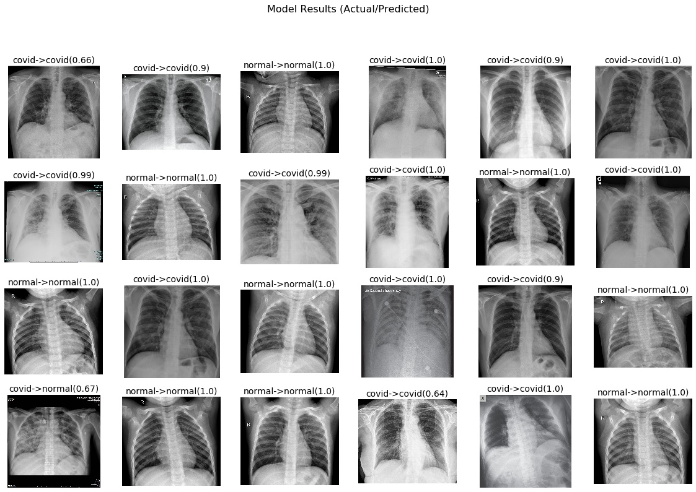

# Detecting COVID-19 in X-ray images with Deep Learning

This repository presents results of initial work to detect Covid-19 from X-ray images

> How could COVID-19 be detected in X-ray images?
* Ref: [https://www.pyimagesearch]( https://www.pyimagesearch.com/2020/03/16/detecting-covid-19-in-x-ray-images-with-keras-tensorflow-and-deep-learning)
* Doctors frequently use X-rays and CT scans to diagnose pneumonia, lung inflammation, abscesses, and/or enlarged lymph nodes.
* COVID-19 attacks the epithelial cells that line our respiratory tract, so we can use X-rays to analyze the health of a patient’s lungs.
* Nearly all hospitals have X-ray imaging machines, it could be possible to use X-rays to have initial test for COVID-19 without the dedicated test kits.

## Data Set
* As Suggested by * Ref: [https://www.pyimagesearch]( https://www.pyimagesearch.com/2020/03/16/detecting-covid-19-in-x-ray-images-with-keras-tensorflow-and-deep-learning)
> COVID-19
* Images used in training are from different recent publications as these are the images that are already available
* Collected and Shared by: Dr Joseph Paul Cohen. Postdoctoral Fellow, Mila, University of Montreal], https://github.com/ieee8023/covid-chestxray-dataset

> Normal Images
* Dataset: Chest X-Ray Images (Pneumonia), https://www.kaggle.com/paultimothymooney/chest-xray-pneumonia
* It has two types of X-Ray images Normal and Pneumonia but only normal X-Rays have been used from this dataset so that Model learns to identify Covid-19 cases.

> Images
* 1400 images was split in 1050 and 350 for training and testing
* Weighted sampling used due to imbalanced data

## Results

## Sanity Check

## Area Under the Receiver Operating Characteristic Curve (ROC AUC)

## Project Member
[Dr. Nagender Aneja, http://ResearchID.co/naneja ](http://ResearchID.co/naneja)

## Feedback
Please submit your feedback to (nanejaATgmail).
